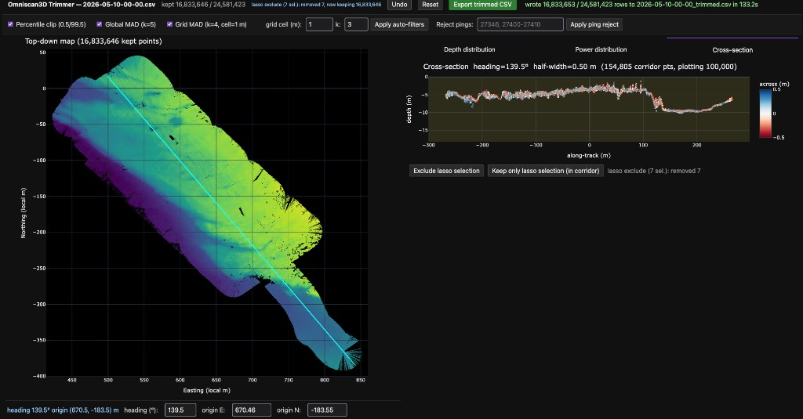
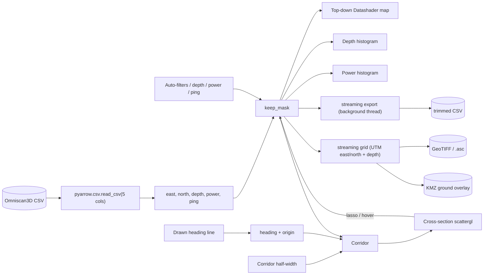

# Point Cloud Trimmer

An interactive Plotly Dash app for cleaning Omniscan3D point-cloud CSVs.
Loads a 15-column CSV, auto-prunes positive depths and gross outliers,
then lets you refine the trim interactively by drawing a compass-heading
cross-section on a top-down map, inspecting depth and power histograms,
and lasso-rejecting fliers. Exports a trimmed CSV with the original 15
columns preserved, or a gridded depth surface ready for **QGIS** contour
extraction (GeoTIFF / Esri ASCII Grid) and **Google Earth** viewing (KMZ).



The app is designed for the ~11M-point files the Omniscan3D produces
today and is validated up to ~50M points. Memory is bounded and does
not scale with the CSV's full row width because the source table is
never held in RAM — only five compact math/filter arrays are.

## Install

```bash
python -m venv .venv
source .venv/bin/activate
pip install -r requirements.txt
```

Python 3.11 or newer is required.

## Run

```bash
python -m scripts.run /path/to/2026-05-09-23-43.csv
```

Then open <http://127.0.0.1:8050> in a browser. Options:

- `--port 8060` — serve on a different port
- `--host 0.0.0.0` — bind to all interfaces
- `--debug` — Dash debug mode

## Workflow

1. **Launch.** The CSV is loaded with PyArrow, reading only the five
   columns the app needs (`easting (local m)`, `northing (local m)`,
   `altitude (m)`, `power (dB)`, `ping number`). Positive depths are
   dropped automatically; everything else is kept.
2. **Auto-filters.** In the top bar, tick any of:
   - **Percentile clip (0.5 / 99.5)** — robust to a few wild pings.
   - **Global MAD (k=5)** — drops anything more than k·MAD from the
     overall depth median.
   - **Grid MAD (k=4, cell=1 m)** — bins points into 2D cells and
     drops points more than k·MAD from the cell median depth. The
     workhorse filter for sonar scatter. Adjust the cell size and `k`
     to taste, then click **Apply auto-filters**. The status line
     reports how many points each click removed.
3. **Draw a heading line on the map.** Use the line-draw tool in the
   map modebar to draw a stroke in the compass direction you want to
   inspect. The line's midpoint becomes the cross-section origin, its
   direction becomes the compass heading. You can also type an exact
   heading angle or origin coordinates in the inputs below the map.
4. **Set a corridor.** The corridor half-width slider expands the line
   into a strip — everything inside the strip becomes the
   cross-section. The current width is shown live next to the label.
5. **Inspect the swath.**
   - **Cross-section** tab shows depth vs along-track for the corridor,
     colored by across-track distance (red/blue diverging from the
     heading line). Hover any point and a magenta "X" lights up on the
     top-down map at the corresponding geographic location, so you can
     orient yourself.
   - **Depth distribution** tab has a histogram of the kept depths;
     toggle "histogram of corridor only" to switch between global and
     in-corridor views. Multimodal returns (water surface, seabed,
     side-lobe tails) become visible.
   - **Power distribution** tab shows the histogram of return strength
     in dB. Power increases left → right; weak echoes (left side) are
     usually noise.
6. **Trim.** Three options, in any order — all push the previous mask
   onto an undo stack:
   - In the **Depth distribution** tab, drag the range slider to
     bracket the seabed peak and click **Apply depth range**.
   - In the **Power distribution** tab, drop weak echoes (typically
     below ~85–90 dB) with the range slider and **Apply power range**.
   - In the **Cross-section** tab, lasso obvious fliers and click
     **Exclude lasso selection** (or **Keep only lasso selection** to
     keep just the lasso'd subset within the corridor).
7. **Reject bad pings.** If a swath segment is bad (boat turn, GPS
   dropout), type the ping numbers or ranges (e.g. `27346,
   27400-27410`) into the **Reject pings** field and click **Apply
   ping reject**.
8. **Iterate.** Draw a different heading and repeat — filters
   accumulate. Use **Undo** to step back through the last ten actions;
   **Reset** returns to the initial post-load mask (positives only
   dropped).
9. **Export.** Two kinds of output, both streamed on a background thread
   with a live status line (percent complete, rows scanned, elapsed,
   ETA):
   - **Export trimmed CSV** — streams the original CSV chunk-by-chunk
     through PyArrow and writes `<stem>_trimmed.csv` alongside the
     source file, with the original 15 columns and row order preserved
     verbatim.
   - **Export DEM** — bins the kept points onto a regular grid and
     writes a depth surface for GIS tools. See
     [Exporting for GIS](#exporting-for-gis-qgis-contours--google-earth)
     below.

## Exporting for GIS (QGIS contours & Google Earth)

The **Export DEM** button (top bar) turns the *kept* points into a
gridded depth surface. It uses the true projected coordinates in the
CSV (`easting (UTM m)` / `northing (UTM m)`), which are consistent
across runs, and auto-detects the CRS from the `coordinate projection`
column (e.g. `UTM zone 5N` → EPSG:32605). Pick three things, then click
**Export DEM**:

- **DEM cell (m)** — grid resolution. Smaller = finer but more empty
  (NoData) cells where coverage is sparse. Match this to your point
  spacing; for swath data, 0.5–1.0 m is usually a good start.
- **Aggregation** — the per-cell depth value: `mean` (smoothest),
  `min` (deepest point in the cell), or `max` (shoalest).
- **Format** — `GeoTIFF (.tif)`, `ASCII grid (.asc)`, or
  `KMZ (Google Earth)`.

The output is written next to the source CSV as
`<stem>_dem_<agg>_<cell>m.<ext>`. The status line and filename always
echo the exact parameters used.

### QGIS — extract contour lines

Use **GeoTIFF** (recommended: compressed, tiled, with embedded CRS and
internal overviews so large grids render fast) or **ASCII grid** (plain
text `.asc` plus a `.prj` sidecar — keep the two together).

1. Drag the `.tif` (or `.asc`) onto the QGIS canvas. It georeferences
   itself; the GeoTIFF needs no sidecar.
2. *(Optional, for nicer contours)* Coverage between swath tracks is
   often sparse, so fill small gaps first:
   **Raster → Analysis → Fill nodata…** (search distance of a few
   cells), and optionally **Raster → Analysis → Smooth**.
3. **Raster → Extraction → Contour…**, choose the DEM, set an interval
   (e.g. `0.5` or `1.0` m) and an attribute name (e.g. `ELEV`), and
   **Run**. The result is contour polylines tagged with depth.
4. Style/label via the layer's **Symbology** / **Labels** tabs.

Depths are negative (below datum); empty cells use NoData `-9999`,
which QGIS reads automatically and renders transparent.

### Google Earth — view a colorized surface

Use the **KMZ** format. Unlike the GeoTIFF/asc (raw float data, which
Google Earth cannot render), the KMZ bakes a **viridis depth gradient**
into a transparent PNG (dark = deep, bright = shallow), reprojects it to
WGS84, and wraps it as a `<GroundOverlay>`.

1. Export with format **KMZ (Google Earth)**.
2. Double-click the `.kmz` (Google Earth Pro) or import it in Google
   Earth Web. It overlays in place, colored by depth.

The color scale is auto-fit to the 2nd–98th percentile of depths (so a
few outliers don't wash it out); the exact range is noted in the
overlay's description. Google Earth shows the colored *surface*, not
contour lines — to get contour lines there, generate them in QGIS (see
above) and export those vectors to KML.

## Common multi-beam cleaning approaches

The core filter loop mirrors the long-standing manual MBES
subset-editor pattern (CARIS HIPS, QPS Qimera, MB-System `mbedit`):

- **Range gating** → percentile clip + depth-range slider
- **Statistical outlier removal** → global MAD
- **Surface-based cell filter (CUBE-lite)** → grid MAD
- **Manual cross-section editing** → cross-section tab + lasso
- **Across- / along-track slices** → generalized to *any* compass
  heading
- **Amplitude-based rejection** → power threshold
- **Ping rejection** → ping-reject text input

## Memory footprint

Five compact arrays + a bit-packed undo history dominate memory;
nothing else grows with N.

| N (rows) | Steady-state RAM | Load time |
|---:|---:|---:|
| 11M | ~240 MB | ~5–8 s |
| 55M | ~1.15 GB | ~20–30 s |

Export is streaming and peaks at one record batch (~300–400 MB),
independent of file size.

## Architecture



## Out of scope

- Reprojection for the interactive view (it uses the CSV's planar local
  meters). The DEM/KMZ export does read the CSV's UTM columns and, for
  KMZ, warps to WGS84 — but the app does no datum/projection
  transforms of its own beyond that.
- 3D point-cloud visualization (this tool is 2D map + cross-section).
- Multi-file sessions or saving/loading filter recipes.
- Sound-velocity refraction correction and full CUBE/uncertainty
  modeling.
- Honoring the `classification` column or filtering by `channel`.

## Project layout

```
point-cloud-trimmer/
  requirements.txt
  README.md
  trimmer/
    __init__.py
    data.py       # pyarrow load, in-memory state, threaded streaming CSV + DEM export
    dem.py        # gridding + GeoTIFF / Esri ASCII Grid / KMZ writers
    filters.py    # pure keep-mask transforms (9 filters + ping spec parser)
    geom.py       # compass heading, along/across, corridor
    views.py      # Plotly figure builders (Datashader top-down, hists, scattergl)
    app.py        # Dash layout + callbacks (incl. clientside hover marker)
    assets/
      style.css   # dark-theme overrides for inputs, sliders, tooltips
  scripts/
    __init__.py
    run.py        # CLI entry point
```
